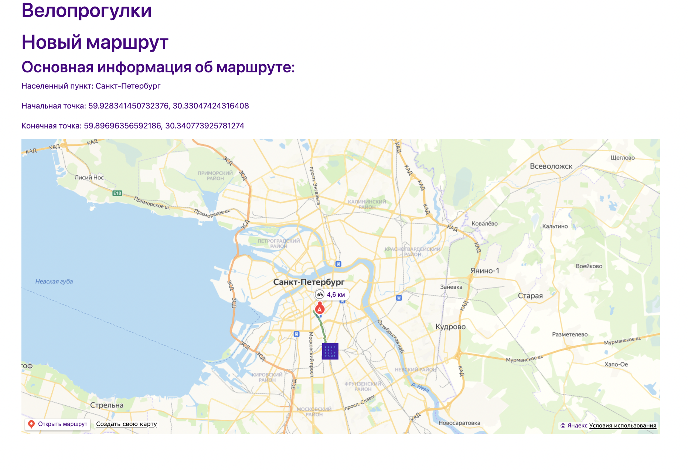

# Велопрогулки
Сервис для создания собственных веломаршрутов на карте, с возможностью поделиться ими с другими пользователями

## Главная страница 
Содержит список готовых маршрутов, к которым прилагается их расположение на карте
По клику на название, можно посмотреть дополнительную информацию о маршруте

## Форма входа 

## Форма регистрации 

## Детальная информация о маршруте 

## Личный кабинет 

**Форма добавления маршрута**

Поле для ввода названия маршрута и населенного пункта

Карта, c возможностью поставить начальную и конечную точку маршрута

**Просмотр всех маршрутов, добавленных конкретным пользователем**

